# Sơ đồ ERD — QLĐT 115 (Giai đoạn 1)

> Khớp 100% với `supabase/migrations/20260905000000_initial_schema.sql` (nguồn chân lý: [tientrinh.md](../tientrinh.md) mục 1.2). Không tự thêm/sửa bảng ở đây khi chỉ sửa code — nếu schema đổi, migration mới phải được tạo trước, rồi mới cập nhật file này theo.

```mermaid
erDiagram
    profiles ||--o{ chung_chi : "profile_id"
    profiles ||--o{ lop_hoc : "nguoi_phu_trach_id / created_by"
    chuong_trinh_dao_tao ||--o{ chuong_trinh_mau_bai_giang : "chuong_trinh_id"
    chuong_trinh_dao_tao ||--o{ lop_hoc : "chuong_trinh_id (tuy chon)"
    lop_hoc ||--o{ bai_giang : "lop_hoc_id"
    profiles ||--o{ dang_ky_giang_day : "profile_id / nguoi_duyet_id"
    lop_hoc ||--o{ dang_ky_giang_day : "lop_hoc_id"
    bai_giang ||--o{ dang_ky_giang_day : "bai_giang_id"
    lop_hoc ||--o{ lich_giang : "lop_hoc_id"
    bai_giang ||--o{ lich_giang : "bai_giang_id"
    profiles ||--o{ lich_giang : "giang_vien_id / tro_giang_id"
    kpi_ky ||--o{ kpi_tieu_chi_theo_ky : "kpi_ky_id"
    kpi_tieu_chi ||--o{ kpi_tieu_chi_theo_ky : "tieu_chi_id"
    profiles ||--o{ danh_gia_kpi : "profile_id / nguoi_danh_gia_id"
    kpi_ky ||--o{ danh_gia_kpi : "kpi_ky_id"
    kpi_tieu_chi ||--o{ danh_gia_kpi : "tieu_chi_id"
    profiles ||--o{ kpi_tong_hop : "profile_id"
    kpi_ky ||--o{ kpi_tong_hop : "kpi_ky_id"
    kpi_ky ||--o{ kpi_he_so_quy_doi : "kpi_ky_id"
    profiles ||--o{ loi_moi_giang_day : "profile_id / nguoi_moi_id"
    lop_hoc ||--o{ loi_moi_giang_day : "lop_hoc_id"
    lop_hoc ||--o{ khao_sat_hoc_vien : "lop_hoc_id"
    profiles ||--o{ khao_sat_hoc_vien : "profile_id"
    profiles ||--o{ hoat_dong_hoc_thuat : "profile_id"
    profiles ||--o{ mentor_mentee : "mentor_id / mentee_id"
    profiles ||--o{ hoat_dong_chung : "profile_id"
    profiles ||--o{ ky_luat_khen_thuong : "profile_id / nguoi_ghi_nhan_id"
    profiles ||--o{ thong_bao : "profile_id"
    profiles ||--o{ audit_log : "thuc_hien_boi"

    profiles {
        uuid id PK
        text full_name
        text role
        text hoc_vi
        text chuc_danh
        text chuyen_mon
        text don_vi_cong_tac
        text so_dien_thoai
        date ngay_vao_lam
        text avatar_url
        boolean trang_thai_hoat_dong
    }
    chung_chi {
        uuid id PK
        uuid profile_id FK
        text ten_chung_chi
        date ngay_cap
        date ngay_het_han
        text file_url
        boolean bat_buoc
    }
    chuong_trinh_dao_tao {
        uuid id PK
        text ten_chuong_trinh
        text mo_ta
    }
    chuong_trinh_mau_bai_giang {
        uuid id PK
        uuid chuong_trinh_id FK
        text ten_bai
        text chuyen_de
        int thoi_luong_tiet
        int thu_tu
    }
    lop_hoc {
        uuid id PK
        uuid chuong_trinh_id FK
        text ten_lop
        text loai_lop
        text hinh_thuc
        boolean co_kinh_phi
        boolean la_lop_gap
        boolean la_gio_hiem
        boolean la_lop_cong_dong
        date ngay_khai_giang
        date ngay_ket_thuc
        int so_giang_vien_can
        int so_tro_giang_can
        text trang_thai
        uuid nguoi_phu_trach_id FK
        uuid created_by FK
    }
    bai_giang {
        uuid id PK
        uuid lop_hoc_id FK
        text ten_bai
        text chuyen_de
        int thoi_luong_tiet
        int thu_tu
    }
    dang_ky_giang_day {
        uuid id PK
        uuid profile_id FK
        uuid lop_hoc_id FK
        uuid bai_giang_id FK
        text vai_tro
        text loai_dang_ky
        text trang_thai
        uuid nguoi_duyet_id FK
    }
    lich_giang {
        uuid id PK
        uuid lop_hoc_id FK
        uuid bai_giang_id FK
        uuid giang_vien_id FK
        uuid tro_giang_id FK
        timestamptz ngay_gio
        text buoi
        text trang_thai
        timestamptz thoi_diem_huy
    }
    kpi_ky {
        uuid id PK
        text ten_ky
        date ngay_bat_dau
        date ngay_ket_thuc
        text trang_thai
    }
    kpi_tieu_chi {
        uuid id PK
        text ten_tieu_chi
        numeric thang_diem
    }
    kpi_tieu_chi_theo_ky {
        uuid id PK
        uuid kpi_ky_id FK
        uuid tieu_chi_id FK
        numeric trong_so
    }
    danh_gia_kpi {
        uuid id PK
        uuid profile_id FK
        uuid kpi_ky_id FK
        uuid tieu_chi_id FK
        numeric diem
        uuid nguoi_danh_gia_id FK
        text loai_nguoi_danh_gia
    }
    kpi_tong_hop {
        uuid id PK
        uuid profile_id FK
        uuid kpi_ky_id FK
        numeric tong_diem
        numeric diem_nhom_a
        numeric diem_nhom_b
        numeric diem_nhom_c
        numeric diem_nhom_d
        text xep_hang
    }
    kpi_he_so_quy_doi {
        uuid id PK
        uuid kpi_ky_id FK
        text loai_he_so
        numeric gia_tri
    }
    loi_moi_giang_day {
        uuid id PK
        uuid profile_id FK
        uuid lop_hoc_id FK
        uuid nguoi_moi_id FK
        text phan_hoi
        timestamptz thoi_han_phan_hoi
    }
    khao_sat_hoc_vien {
        uuid id PK
        uuid lop_hoc_id FK
        uuid profile_id FK
        numeric diem
        text nhan_xet
    }
    hoat_dong_hoc_thuat {
        uuid id PK
        uuid profile_id FK
        text loai
        text ten_hoat_dong
        date ngay
        numeric diem_quy_doi
    }
    mentor_mentee {
        uuid id PK
        uuid mentor_id FK
        uuid mentee_id FK
        date ngay_bat_dau
        date ngay_ket_thuc
        text trang_thai
    }
    hoat_dong_chung {
        uuid id PK
        uuid profile_id FK
        text ten_hoat_dong
        date ngay
        numeric diem_quy_doi
    }
    ky_luat_khen_thuong {
        uuid id PK
        uuid profile_id FK
        text loai
        text noi_dung
        numeric diem_anh_huong
        uuid nguoi_ghi_nhan_id FK
    }
    thong_bao {
        uuid id PK
        uuid profile_id FK
        text tieu_de
        text noi_dung
        text duong_dan
        boolean da_doc
    }
    audit_log {
        uuid id PK
        text bang
        uuid ban_ghi_id
        text hanh_dong
        jsonb du_lieu_cu
        jsonb du_lieu_moi
        uuid thuc_hien_boi FK
    }
```

